  <h1>Hey  I'm Chamath Sandaru</h1>
  
<strong>Software Engineering Student | Full-Stack Developer | IoT Enthusiast</strong>

  

    
    
  

---

### 💫 About Me

  

    I am Chamath Sandaru, a Software Engineering student at the Java Institute, specializing in building scalable web architectures and high-performance mobile applications. My core expertise lies in the synergy between Full-Stack Development (Spring Boot, React) and Native Android environments.
  

  <picture>
    <source media="(max-width: 600px)" srcset="./skill_progress_mobile.svg">
    
  </picture>

    

  <picture>
    <source media="(max-width: 600px)" srcset="./about_card_mobile.svg">
    
  </picture>

---

### 🤖 Intelligence & Frameworks

  

 

  
  
  
  

---

### 🛠️ Strategic Tools & Creative Arsenal

  

---

### 📊 Performance Metrics & Activity

  
  

   
  

 

  <picture>
    <source media="(prefers-color-scheme: dark)" srcset="https://raw.githubusercontent.com/ChamathSadaru/ChamathSadaru/output/isocalendar.svg">
    <source media="(prefers-color-scheme: light)" srcset="https://raw.githubusercontent.com/ChamathSadaru/ChamathSadaru/output/isocalendar.svg">
    
  </picture>

---

  <h3>🤝 Connect with the Developer</h3>
  
  
  
  

 

  <picture>
    <source media="(max-width: 600px)" srcset="./footer_mobile.svg">
    
  </picture>

<i>"Code is like humor. When you have to explain it, it’s bad."</i>

